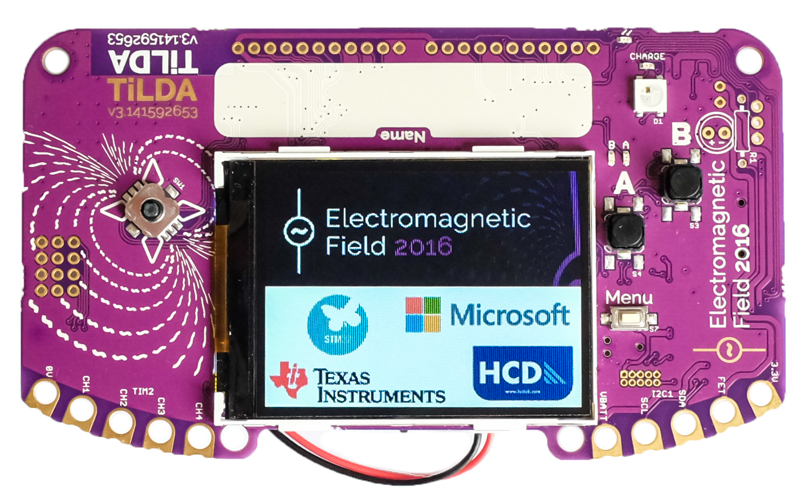
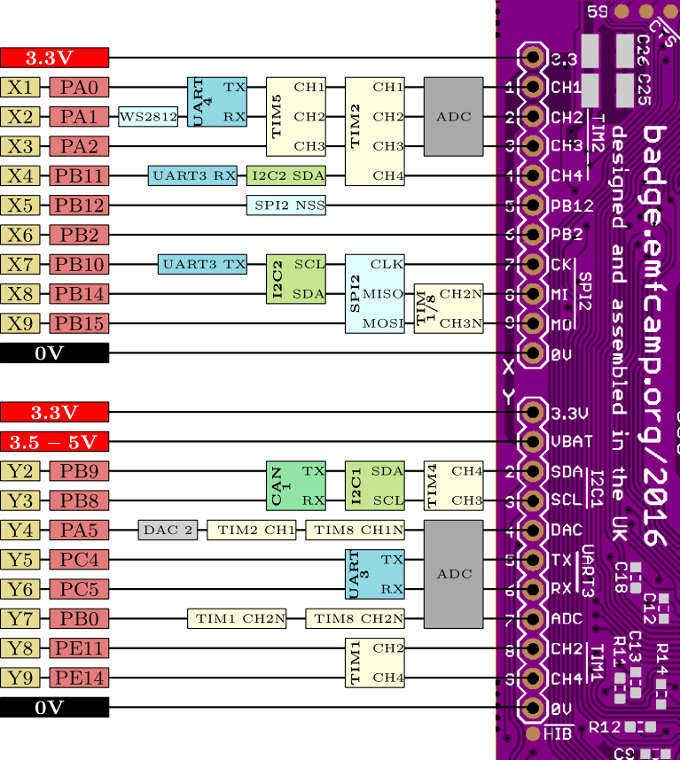
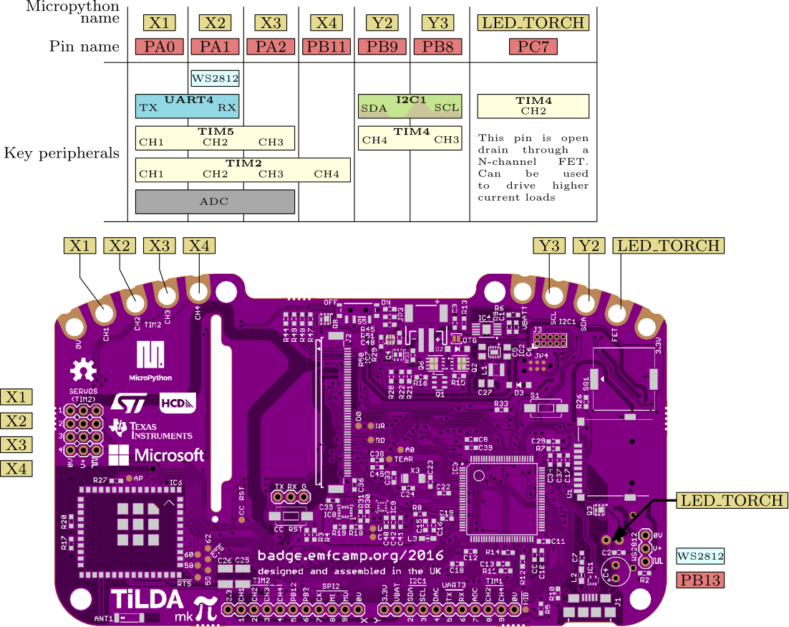

<figure>

<figcaption>TiLDA_MK3_front.jpg</figcaption>
</figure>

## Using your badge

<strong>If you just got your badge and it doesn't do anything</strong>,
don't despair, quite a few of them need to be
<a href="TiLDA_MK3/reset" class="wikilink" title="factory reset">factory
reset</a> before showing the loading screen. Press and hold `MENU` while
quickly pressing the reset button at the back. Keep the `MENU` button
hold for another 2 seconds while the green light on the front is
blinking. Release it <i>while</i> the green light <b>and</b> the screen
back light is on. If you got it correct the red light should flash.
If this doesn't work you can
<a href="TiLDA_MK3/Firmware_Update" class="wikilink"
title="update the badge firmware">update the badge firmware</a>. If this
doesn't work, please come and join us in \#emfcamp-badge on [Libera
IRC](https://libera.chat/)

If you're having problems downloading some apps from the App Library
<b>please update your badge via the App Library update option</b>. After
a restart it should work much smoother.

### Assembly

With your badge you will receive a booklet explaining how it's done. If
you have any problems, please come to the Badge Operation Center and we
will help you.

### Basic usage

After you have assembled your badge you can just use the tiny switch at
the bottom of the screen to turn your badge on. Alternatively you can
use any USB power source. If you turn your badge on for the first time
(or if for some reason it has reset itself) you will get some on-screen
information while we try to download the newest set of software.

If at any point you want to restart your badge you can just press the
reset button at the back.

#### Changing your name

1.  Press 'Menu'
2.  Select the 'Change Name' app and press 'A'
3.  Use the joystick and 'A' key to enter your name
4.  Press 'Menu' to save your name and reset the badge - your name
    should now be displayed!

#### Installing new apps

1.  Press 'Menu'
2.  Select the 'App Library' app and press 'A'
3.  Select "Browse App Store"
4.  Select a category and then an app. Wait until you see the
    description and press "A" to save it.
5.  Press B a few times (or alternatively MENU) to restart your badge
6.  On the home screen you can now press MENU and select "View all" to
    find your newly installed app. If you want to pin it to the quick
    launcher screen select your app and press MENU. If you just want to
    start it press A instead.

### WiFi

Your TiLDA Badge has built-in wifi support. It should all just work if
you're at the campsite, but if you're on your own network you might have
to tell the badge about it. For more information please have a look
here: <a href="TiLDA_MK3/wifi" class="wikilink" title="WiFi">WiFi</a>

<strong>A word of warning</strong>: During EMF the badge will use
"emf-insecure". This is, as the name implies, not the most secure way of
transmitting data. On top of that there are some problems with HTTPS and
SSL, so we're not using it for with the default apps (we're working on
it!). Please don't send anything private or
important to or from the badge via wifi.

### Charging

The badge charges via a microUSB socket, and takes about 2-3 hours for a
full charge. The red charge LED next to the USB connector will
extinguish when charging is complete

### Nothing works! Help!

Don't worry, you can always "factory reset" your badge. Please follow
these instructions: <a href="TiLDA_MK3/reset" class="wikilink"
title="Resetting">Resetting</a>

If everything else absolutely fails, you can try following these
instructions (advanced):
<a href="TiLDA_MK3/Firmware_Update" class="wikilink"
title="TiLDA_MK3/Firmware_Update">TiLDA_MK3/Firmware_Update</a>

## Hacking your badge

**<a href="TiLDA_MK3/Introduction_to_badge_hacking" class="wikilink"
title="Badge Hacking Workshop Documentation">Badge Hacking Workshop
Documentation</a>**

One of the main goals of TiLDA is to make hacking it as easy as
possible. All you need to do so is a computer with USB and your badge.

- **<a href="TiLDA_MK3/Get_Started" class="wikilink"
  title="Step-by-step: How to get started">Step-by-step: How to get
  started</a>**
- **<a href="TiLDA_MK3/Run_Code" class="wikilink"
  title="3 Ways to run code on your TiLDA">3 Ways to run code on your
  TiLDA</a>**
- <a href="TiLDA_MK3/App_Store_Submissions" class="wikilink"
  title="App Store Submissions">App Store Submissions</a>

The badge itself runs code written in the computer language
[Python](https://en.wikipedia.org/wiki/Python_(programming_language))
which is run by a bit of software called
[Micropython](https://micropython.org/).

For more information about the functions available please have a look at
the
<a href="#Badge_API" class="wikilink" title="Badge API">Badge API</a>
section of this page.

If you're already familiar with all this you can jump right into the
topic of Apps. Apps can be shared via the EMF App Library or by copying
files of and on via USB. If you want to know more about how this works
go to
<a href="TiLDA_MK3/apps" class="wikilink" title="TiLDA MK3/apps">TiLDA
MK3/apps</a>

In case you're more interested in what makes the hardware tick and your
confident with C++ and microprocessors then you can work directly with
the micropython code that runs TiLDA:
<a href="TiLDA_MK3/build" class="wikilink"
title="How to build the firmware from scratch">How to build the firmware
from scratch</a>

All code used is hosted on Github. Contributions and PR are very
welcome!

- <https://github.com/emfcamp/micropython>
- <https://github.com/emfcamp/Mk3-Firmware>
- <https://github.com/emfcamp/Mk3-Server>

### Some ideas

<a href="TiLDA_MK3/Ideas" class="wikilink"
title="Please share what you&#39;ve done (or want to do) with others!">Please
share what you've done (or want to do) with others!</a>

[Laser cut case
files](https://github.com/emfcamp/Mk3-Hardware/blob/master/case-final.dxf)

The files used in the **Fab Lab Truck** for lasercutting are available
here: <http://www.thingiverse.com/thing:1707973>

## Badge API

### Build-in

- [documentation](http://docs.micropython.org/en/latest/pyboard/) -
  General Micropython libarary
- <a href="TiLDA_MK3/ugfx" class="wikilink" title="uGFX">uGFX</a> - The
  TiLDA LCD colour screen
- <a href="TiLDA_MK3/documentation/cc3100" class="wikilink"
  title="CC3100">CC3100</a> - The wifi chip
- <a href="TiLDA_MK3/rtc" class="wikilink" title="RTC">RTC</a> (real
  time clock)
- <a href="TiLDA_MK3/adc" class="wikilink" title="ADC">ADC</a> (analogue
  reading)
- <a href="TiLDA_MK3/timer" class="wikilink" title="Timer">Timer</a>
- Microcontroller peripherals
  [1](https://docs.micropython.org/en/latest/pyboard/library/pyb.html)
  (Timers, PWM, serial,
  <a href="TiLDA_MK3/spi" class="wikilink" title="SPI">SPI</a> etc)

### TiLDA Libraries

On top of the build-in modules above we have also created a bunch of
helpful libraries written in python. If you go through the bootstrap
process or use the App Library you should always have a full set of
those on your badge. If for some reason this isn't the case you can
download our repository from <https://github.com/emfcamp/Mk3-Firmware>
and copy the `lib` folder onto your badge.

TBD, for now please have a look at the libraries themselves:
<https://github.com/emfcamp/Mk3-Firmware/tree/master/lib>

- <a href="TiLDA_MK3/lib/buttons" class="wikilink"
  title="buttons">buttons</a>
- database
- dialogs
- filesystem
- http_client
- imu
- wifi
- NTP Example:
  <https://gist.github.com/drrk/4a17c4394f93d0f9123560af056f6f30>
- On board LED "<a href="TiLDA_MK3/NeoPixel" class="wikilink"
  title="NeoPixel">NeoPixel</a>" example:
  <https://github.com/mayhem/tilda-mk3-led-demo>

Full hardware files are on GitHub
[2](https://github.com/emfcamp/Mk3-Hardware)

(feel free to add additional ideas, and create links new wiki pages to
on-going projects, perhaps someone will want to contribute)

## Badge hardware

TiLDA comes with a long list of very useful hardware. Some might be
obvious, but some are a bit hidden.

- Colour LCD screen 320x240
- Joystick and A/B/Menu Buttons
- Wifi (cc3100)
- Accelerometer
- Compass
- Buzzer
- Battery
- <s>WS2812B aka "Neo Pixel"</s> on port PB13. [Sadly
  defunct](https://badge.emfcamp.org/wiki/TiLDA_MK3/How_to_fix_NeoPixel)
- MicroSD slot

Harware files are available on GitHub
[3](https://github.com/emfcamp/Mk3-Hardware).

NOTE: The WS2812B is actually on pin PB13, not X2 as shown below!

