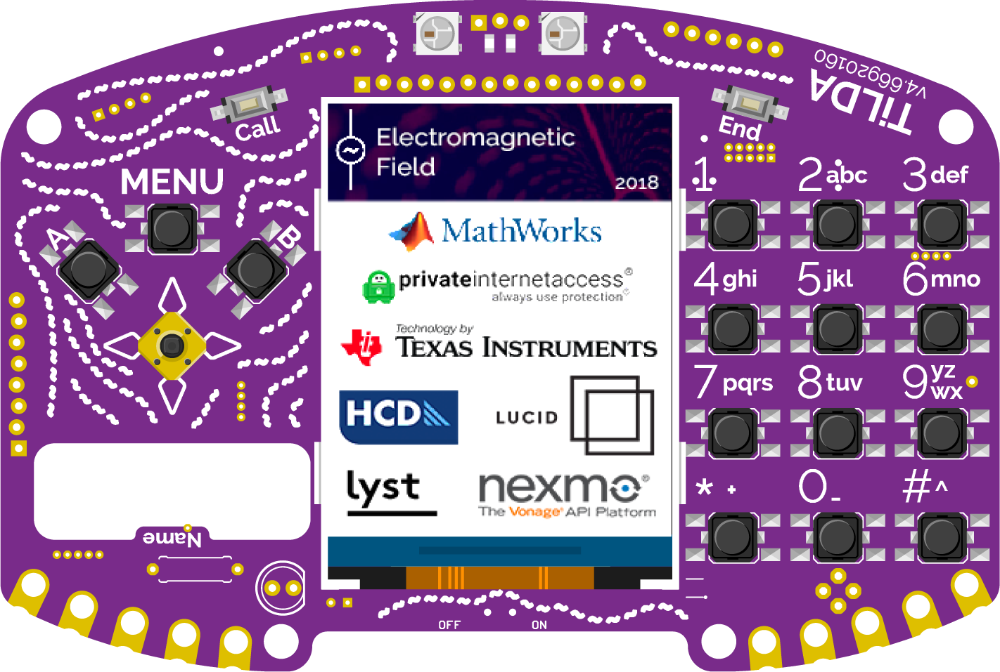
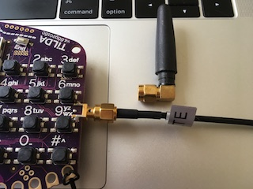
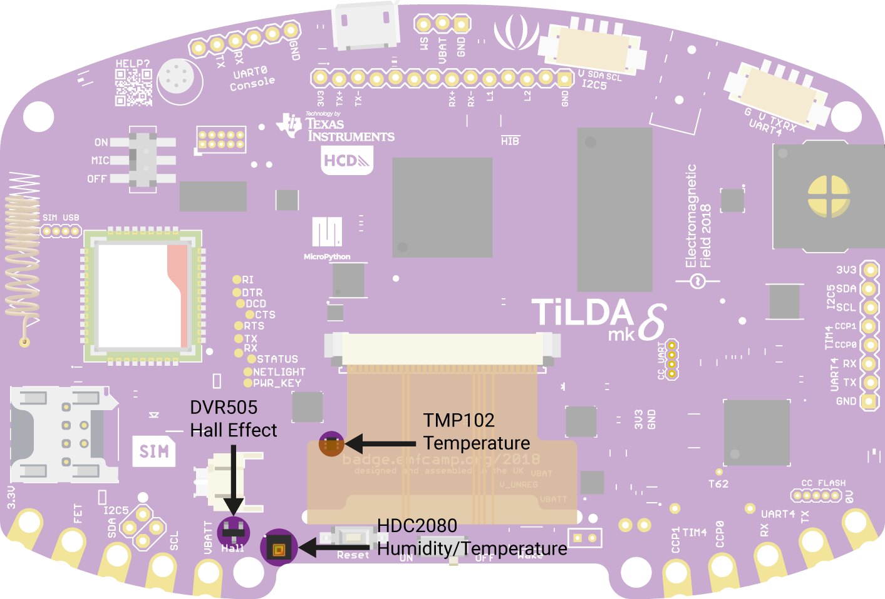
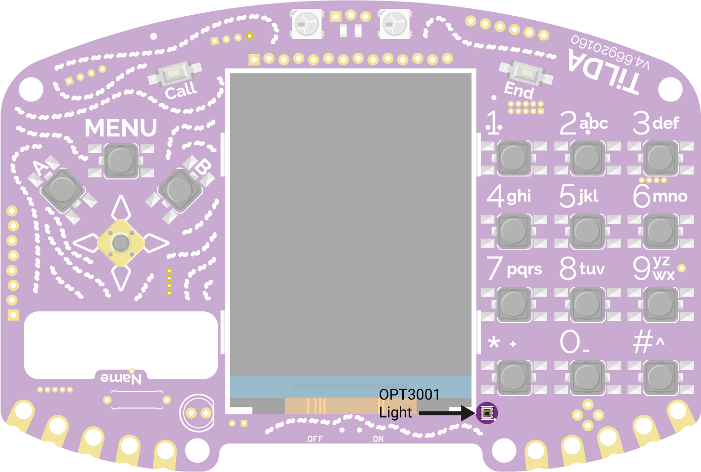

<figure>

<figcaption>TiLDA_Mk4_Front_with_sponsors.png</figcaption>
</figure>

## Using your badge

<strong>If you just got your badge and it doesn't do anything</strong>,
don't despair, quite a few of them need to be
<a href="TiLDA_MK4/reset" class="wikilink" title="factory reset">factory
reset</a> before showing the loading screen. Press and hold `MENU` while
quickly pressing the reset button at the back. Keep the `MENU` button
hold for another 2 seconds. Release it when both the red and green LED
are lit. If you got it correct both LEDs should flash a few times.
If this doesn't work you can
<a href="TiLDA_MK4/Firmware_Update" class="wikilink"
title="update the badge firmware">update the badge firmware</a>. If this
doesn't work, please come and join us in \#emfcamp-badge on [Libera
IRC](https://libera.chat/)

### Updating your badge firmware

After (and during!) EMF the badge firmware was substantially fixed and
improved, resolving issues with call handling and apps.

Please update your badge firmware as soon as possible. You can find
<a href="TiLDA_MK4/Firmware_Update" class="wikilink"
title="documentation on this here">documentation on this here</a>.

### Assembly

With your badge you will receive a booklet explaining how it's done. If
you have any problems, please come to the Badge Operation Center and we
will help you.
Booklet can be found
[here](https://archive.org/details/emf2018_badge_guide)

### Basic usage

After you have assembled your badge you can just use the tiny switch at
the bottom of the screen to turn your badge on. Alternatively you can
use any USB power source. If you turn your badge on for the first time
(or if for some reason it has reset itself) you will get some on-screen
information while we try to download the newest set of software. **This
doesn't always work on the first try, you might have to use "reset" to
try a few times**

If at any point you want to restart your badge you can just press the
reset button on the back below the display ribbon.

#### Changing your name

1.  Press 'Menu'
2.  Select the 'Settings" app
3.  "Change Name" and press 'A'
4.  Use the joystick and 'A' key to enter your name
5.  Press 'Menu' to save your name and reset the badge - your name
    should now be displayed!

#### Installing new apps

1.  Press 'Menu'
2.  Select 'Badge Store' app and press 'A'
3.  Select "Install"
4.  Select a category and then an app. Wait until you see the
    description and press "A" to save it.
5.  Press B a few times (or alternatively MENU) to restart your badge
6.  On the home screen you can now press MENU to find your newly
    installed app.

### WiFi

Your TiLDA Badge has built-in wifi support. It should all just work if
you're at the campsite, but if you're on your own network you might have
to tell the badge about it. For more information please have a look
here: <a href="TiLDA_MK4/wifi" class="wikilink" title="WiFi">WiFi</a>

### Charging

The badge charges via a microUSB socket, and takes about 2-3 hours for a
full charge. The red charge LED to the right of the display ribbon on
the back will extinguish when charging is complete.

### Calling and SMS

**Warning: The badge team are aware of an issue of instability while
using the calling capability. Please bear with us while we diagnose
this.**

Yes your TiLDA Badge is also a mobile phone. To connect to the EMF
mobile network insert the Hologram SIM supplied, load the "phone" app,
select "Select Operator", wait, wait some more, and a little longer,
then select "EMF" or "23404". Select "Auto" to use a public mobile
network again.

To find out your number on the EMF network select "Information" in the
phone app. If "Operator" is not shown on the information screen then you
have failed to connect to the network. If you are not given a number
then wait a little longer and try again. You can read and send SMS
messages with the "sms" app. You can also answer calls by pressing
"Call" in any app, and end or reject a call using the "End" button at
any time.

<Radiocode> The cellular part of the badge seems to work (reliably)
perfectly if an external antenna is used, such as a mag-mount with a
length of coax. Seems to be an EMC issue, as using the pictured right
angle antenna directly on the SMA does not work reliably. Time to get
the Kapton tape and copper foil out...

<figure>

<figcaption><a href="File:GSM">File:GSM</a> Antenna.jpg</figcaption>
</figure>

### Connecting over USB

By default, the software is in a loop. If you want to interact over the
REPL you need to exit this. The easiest way is to press Ctrl-C.

It's hard to press Ctrl-C in minicom, so on Linux this is easier to do
with screen:

    screen /dev/ttyACM0 115200

If you can connect but Ctrl-C has no effect then it is possible that
another service on your machine is accessing the tty before you can
connect. A likely candidate is modemmanager. You can check if
ModemManager is running using:

    systemctl | grep -i modem

and can be stopped with:

    systemctl stop ModemManager.service

On Mac:

    screen /dev/tty.usbmodemTiLDA2

To exit screen, press Ctrl-A, then k, then y.

On Windows:

1.  If you don't have PuTTY or a similar program, get PuTTY installer
    from
    [1](https://www.chiark.greenend.org.uk/~sgtatham/putty/latest.html)
2.  Open PuTTY and select Serial connection
3.  Change COM1 to the COM port for your badge (You can usually find
    this as USB Seiral Port under ports in device manager)

<i>Note: if your badge resets while putty is open,
you will have to close the window and open a new connection to the same
COM port.</i>

The basic process is this:

1.  Connect device to computer with usb
2.  Fire up minicom or screen
3.  Press reset button on device
4.  Hit Ctrl+C quickly and with vigour to get to the REPL before the UI
    comes up

### Nothing works! Help!

Don't worry, you can always "factory reset" your badge. Please follow
these instructions: <a href="TiLDA_MK4/reset" class="wikilink"
title="Resetting">Resetting</a>

If everything else absolutely fails, you can try following these
instructions (advanced):
<a href="TiLDA_MK4/Firmware_Update" class="wikilink"
title="TiLDA_MK4/Firmware_Update">TiLDA_MK4/Firmware_Update</a>

## Hacking your badge

### App Hack

**[A method to hack your app onto your
badge](https://gist.github.com/SteveAmor/8c333927fded2339da54ad4aaa765d7e)**

### Tilda Tools

**<a href="TiLDA_MK4/tilda-tools" class="wikilink"
title="tilda-tools">tilda-tools</a>** - Should now work on Windows,
Linux and OSX

### OSX

Mass storage now works on OSX

**<a href="TiLDA_MK4/Introduction_to_badge_hacking" class="wikilink"
title="Badge Hacking Workshop Documentation">Badge Hacking Workshop
Documentation</a>**

One of the main goals of TiLDA is to make hacking it as easy as
possible. All you need to do so is a computer with USB and your badge.

- **<a href="TiLDA_MK4/tilda-tools" class="wikilink"
  title="tilda-tools">tilda-tools</a>** - the one-stop interface for all
  your badge needs
- **<a href="TiLDA_MK4/Get_Started" class="wikilink"
  title="Step-by-step">Step-by-step</a>** - to make it as easy as
  possible to get going
- **<a href="TiLDA_MK4/Run_Code" class="wikilink"
  title="3 Ways to run code on your TiLDA">3 Ways to run code on your
  TiLDA</a>**
- **<a href="TiLDA_MK4/Badge_Store_Submissions" class="wikilink"
  title="Badge Store Submissions">Badge Store Submissions</a>** - Share
  your creations with others
- **<a href="TiLDA_MK4/Code_Structure" class="wikilink"
  title="Code Structure">Code Structure</a>** - How the python code is
  structured

The badge itself runs code written in the computer language
[Python](https://en.wikipedia.org/wiki/Python_(programming_language))
which is run by a bit of software called
[Micropython](https://micropython.org/).

For more information about the functions available please have a look at
the
<a href="#Badge_API" class="wikilink" title="Badge API">Badge API</a>
section of this page.

In case you're more interested in what makes the hardware tick and your
confident with C++ and microprocessors then you can work directly with
the micropython code that runs TiLDA:
<a href="TiLDA_MK4/build" class="wikilink"
title="How to build the firmware from scratch">How to build the firmware
from scratch</a>

All code used is hosted on Github. Contributions and PR are very
welcome!

- <https://github.com/emfcamp/Mk4-Apps>
- <https://github.com/emfcamp/Mk4-Backend> (powers the badge store)
- <https://github.com/emfcamp/Mk4-micropython-board>

### Building Micropython Firmware

<a href="TiLDA_MK4/BuildingFirmware" class="wikilink"
title="Build Instructions">Build Instructions</a>

### Some ideas

<a href="TiLDA_MK4/Ideas" class="wikilink"
title="Please share what you&#39;ve done (or want to do) with others!">Please
share what you've done (or want to do) with others!</a>

Tips by Ben Woodley (Tested on Ubuntu 18.04 and Debian Stretch)

**If you're having issues with getting the python prompt while using a
serial terminal or the tilda_tools is failing** Error displayed:
SerialTimeoutException: Write Timeout Fix:

- Do this command (ModemManager steals your escape characters!)
- \$ sudo systemctl stop ModemManager.service
- Then make sure your badge is in an app (anything but the purple home
  screen)
- Try open a serial terminal with the device (e.g. screen /dev/ttyACM0
  115200)
- The issue should not persist

**Reflash the firmware**

- If lets say you wanted to **force a firmware update to apply the patch
  for making phone calls** then just follow these steps.
- \$ git clone <https://github.com/micropython/micropython.git>
- \$ cd micropython/ports
- \$ git clone <https://github.com/emfcamp/Mk4-micropython-board.git>
- \$ cd Mk4-micropython-board
- \$ ./inst_tools
- \$ make
- You may need additional packages depending on your distro, follow the
  errors if encountered with inst_tools or make.
- Put the badge in DFU mode (press and hold the centre button of the
  joystick and press reset button, let go of joystick after a second)
- \$ make flash-dfu
- This will reflash the firmware, if it fails your board is either not
  in dfu mode or you need additional packages (like python3-serial in
  apt!)

**Using the Grove Serial connector**

<Radiocode> The Badge Team thoughtfully chose to include a couple of
Seeed Studio Grove system connectors to the 2018 badge. Looking at the
rear of the badge, they are either side of the unpopulated 3.5mm jack
footprint, top right.

- On the left is the Grove I2C connector \<anyone using this?\>
- On the right is the Grove UART connector

The Grove UART is helpfully labelled "UART4". To use it in Python, it is
actually number 2!!!

Example:

import machine

u = machine.UART(2, 9600)

g = u.readline()

etc...

can be used to communicate with the Seeed Studio GPS module. \[Seeed
Studio: <http://wiki.seeedstudio.com/Grove-GPS/>\]

## Badge API

### Build-in

- [documentation](http://docs.micropython.org/en/latest/pyboard/) -
  General Micropython libarary
- <a href="TiLDA_MK4/ugfx" class="wikilink" title="uGFX">uGFX</a> - The
  TiLDA LCD colour screen
- <a href="TiLDA_MK4/documentation/cc3100" class="wikilink"
  title="CC3100">CC3100</a> - The wifi chip
- <a href="TiLDA_MK4/rtc" class="wikilink" title="RTC">RTC</a> (real
  time clock)
- <a href="TiLDA_MK4/sensors" class="wikilink" title="Sensors">Sensors</a>
- <a href="TiLDA_MK4/sim800" class="wikilink" title="SIM800">SIM800</a>
  (GSM/Phone/Bluetooth)
- <a href="TiLDA_MK4/modtilda" class="wikilink"
  title="import tilda">import tilda</a> (our custom micropython module)
- <a href="TiLDA_MK4/spi" class="wikilink" title="SPI">SPI</a> SPI
- <a href="TiLDA_MK4/Neopix" class="wikilink" title="Neopix">Neopix</a>
  WS2812B LEDs
- please add

### TiLDA Libraries

On top of the build-in modules above we have also created a bunch of
helpful libraries written in python. If you go through the bootstrap
process or use the App Library you should always have a full set of
those on your badge. If for some reason this isn't the case you can
download our repository from <https://github.com/emfcamp/Mk4-Firmware>
and copy the `lib` folder onto your badge.

for now please have a look at the libraries themselves:
<https://github.com/emfcamp/Mk4-Apps/tree/master/lib>

(feel free to add additional ideas, and create links new wiki pages to
on-going projects, perhaps someone will want to contribute)

### Hardware

Full hardware files are on GitHub
[2](https://github.com/emfcamp/Mk4-Hardware)

## Badge hardware

TiLDA comes with a long list of very useful hardware. Some might be
obvious, but some are a bit hidden.

- Texas Instruments [MSP432E4 SimpleLink
  Microcontroller](http://www.ti.com/product/MSP432E401Y) (ARM
  Cortex-M4F @ 120MHz)
- Texas Instruments [CC3120 SimpleLink Wi-Fi® Network
  Processor](http://www.ti.com/product/CC3120)
- 256KB internal RAM / 8MB external SDRAM
- 1MB internal flash (firmware) / 1MB external flash (filesystem)
- [SIM800 Quad-band GSM/GPRS
  module](https://simcom.ee/modules/gsm-gprs/sim800c/) with Bluetooth
  support
- [240x320 RGB
  screen](https://cdn.hackaday.io/files/11178478239552/ER-TFT024-3_Datasheet.pdf)
- 2 [WS2812B RGB
  LEDs](https://cdn-shop.adafruit.com/datasheets/WS2812B.pdf) (aka
  Neopixels) with a 3-pin header to connect your own (And this year
  they’re the right way up!)
- Texas Instruments [HDC2080 Low Power Humidity and Temperature
  Sensor](http://www.ti.com/lit/ds/symlink/hdc2080.pdf)
- Texas Instruments [TMP102 Digital Temperature
  Sensor](http://www.ti.com/lit/ds/symlink/tmp102.pdf)
- Texas Instruments [OPT3001 Digital Ambient Light
  Sensor](http://www.ti.com/lit/ds/symlink/opt3001.pdf)
- Texas Instruments [DRV5055 High Accuracy Bipolar Hall Effect
  Sensor](http://www.ti.com/lit/ds/symlink/drv5055.pdf)
- Speaker and Microphone
- 2000mAh Battery
- Onboard Ethernet (requires breakout)
- A [T9](https://en.wikipedia.org/wiki/T9_(predictive_text)) number
  keypad and a joystick
- 2 [Seed Studio Grove
  headers](http://wiki.seeedstudio.com/Grove_System/) (one UART, one
  I²C)
- [Conductive
  thread](https://learn.sparkfun.com/tutorials/sewing-with-conductive-thread)
  points and 0.1" header for power/UART/I2C/GPIO
- [Defcon 26 Shitty Add-Ons
  connector](https://hackaday.io/project/52950-defcon-26-shitty-add-ons)

Hardware files are available on GitHub
[3](https://github.com/emfcamp/Mk4-Hardware).

<a href="Category:_Badges" class="wikilink"
title="Category: Badges">Category: Badges</a>