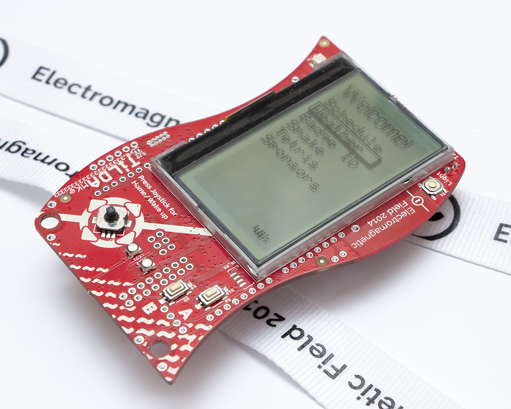
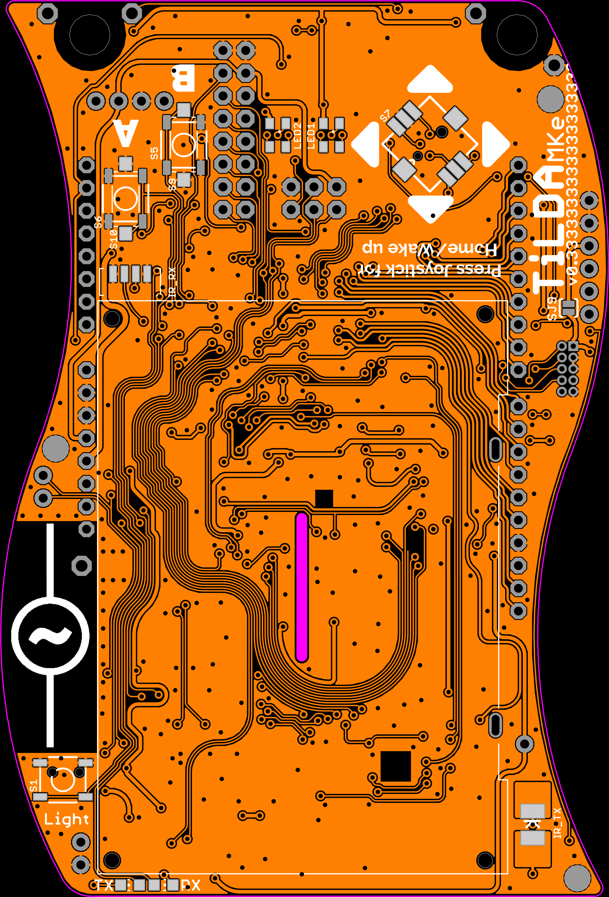
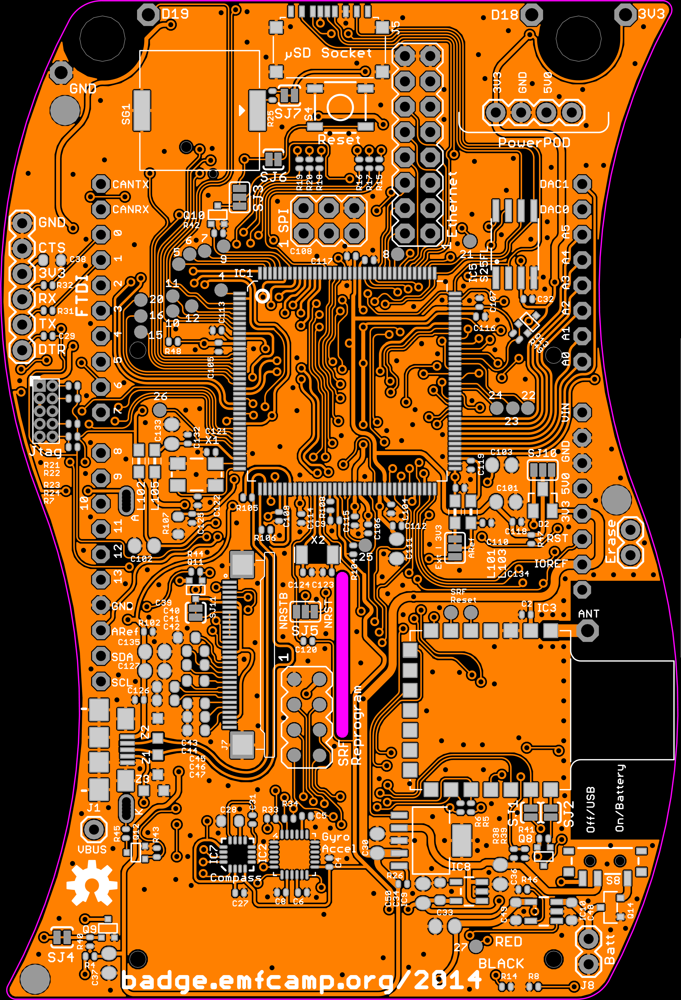

 

[Why MKe?](http://en.wikipedia.org/wiki/E_(mathematical_constant))

# EMF 2014 Badge

The main aim of the 2014 badge is to give camp attendees an interesting
bit of hardware to play with during the camp and experiment with
afterwards. We designed an Arduino compatible platform to allow easy
reuse and access, and have published all code and design files.

[Blog post launching the
badge](http://blog.emfcamp.org/post/94157161753/announcing-tilda-mke-the-incredible-emf-2014-camp)

## Battery Warning

A very last minute battery (and connector) change on the badge due to a
supplier problem meant two issues arose with the badge during EMF:

- **Always make sure to plug your battery in the right way round!** The
  new battery connector allows you to connect it backwards. We did our
  best to mitigate this, but connecting it incorrectly will destroy the
  power management controller and prevent the badge from charging or
  running from the battery. It will still function perfectly using USB
  power. "Red" and "Black" are written next to the connector - please
  make sure to plug it in correctly.

<!-- -->

- **Be careful not to short the battery connector wires!** The new
  battery connector slightly exposes the wires when the battery is
  plugged in. If a metal object shorts the two wires, it can result in
  extreme battery damage. If we'd known this was such an issue before
  the event we would have applied protective material to it - we suggest
  covering the exposed connector in tape, sugru, blu-tack, or some other
  insulating material. Alternatively, simply unplug the battery when
  your badge is not in use!

## My badge is broken!

Due to the aforementioned supplier issues it is possible that you may
have received a faulty badge, or it may have been damaged by connecting
the battery backwards. If you badge will not turn on when it has been
plugged in with a MicroUSB cable (and the power switch on the back is
set to "USB"), or something else seems wrong with it, please email
<badge@emfcamp.org> and we'll try to fix or replace your badge.

# The Hardware

The badge has a plethora of hardware built in for you to play with,
everything from accelerometers and gyroscopes to hidden ethernet
headers! Breaking it all down is too much detail for this document,
however we'll call out some things we built in that you might want to
play with.

Remember the badge is Arduino Due compatible, and we broke out nearly
all the features of the ARM chip so you can access them. [Anything the
Due can do](http://arduino.cc/en/Main/ArduinoBoardDue), the TiLDA can
do!

## Interesting things to play with

Most of the interesting things are on the back of the badge. They're
clearly marked in white. [This diagram of the
back](https://wiki.emfcamp.org/w/images/b/bd/Badge_Back.png) should
allow you to locate them. Some of the following require extra parts to
be added to your badge.

- Full Arduino R3 shield compatible pins (Requires soldering the headers
  on the back of the badge)
- Pins either side of the lanyard holes for conductive thread (D19, D18,
  GND, 3V3)
- Infrared transmitter on the front (Pin shortcut IR_TX_PWM)
- Infrared receiver on the front (Pin shortcut IR_RX, Part Vishay
  TSOP75238TT available from digikey and Farnell )
- Piezo buzzer (Pin shortcut PIEZO or PIEZO_PWM)
- On-board ethernet (not available on the Due) - requires breakout
  module (eBay: Elechouse Taijiuino Ethernet PHY DM9161 Module)
- [MPU-6050](http://www.invensense.com/mems/gyro/mpu6050.html) 3-axis
  Accelerometer and 3-axis gyro (IMUTask.cpp and the MPU6050 library)
- 128x64 pixel backlit LCD display (JHD12864, see [here for
  docs](https://github.com/emfcamp/Mk2-Documentation/tree/master/LCD%20JHD12864))
- [Ciseco SRF
  Radio](http://shop.ciseco.co.uk/srf-wireless-rf-radio-surface-mount/)
- 1 megabit flash module (Part S25FL216K0PMFI011)
- 2x RGB LEDs on the front

Some features are not mentioned here, or optional extras. They can be
found in the <a href="TiLDA_MKe/Full_Specification" class="wikilink"
title="TiLDA_MKe/Full_Specification">TiLDA_MKe/Full_Specification</a>

# The Software

## Basic post-event features

We made sure that the badge has a few features to play with once the
event is over. More will be added over time as attendees submit changes
to us.

<figure>

<figcaption>Badge_Back.png</figcaption>
</figure>

- Torch mode - Press the light button next to the screen. It will only
  light up fully if it's hung upside down to avoid blinding
- Snake
- Tetris

But of course the point of the badge is to modify it and use it for
other interesting things! The following sections describe how to update
the firmware on the badge, how to use it as a simple arduino, and how to
write your own code for the main badge firmware.

## Getting help

The EMF 2014 badge is a complex piece of hardware and software, however
remember that you can just treat it as an Arduino if you find it all too
daunting.

If you get stuck and need advice, join us in \#emfcamp-badge on [Libera
IRC](https://libera.chat/) to ask for advice, or if you're really stuck
you can email us on <badge@emfcamp.org>.

## How to update the badge software

The badge software has been substantially updated since EMF, fixing bugs
and removing features that will no longer work now you're away from our
radio network. You should update your badge before starting to play with
it any further. If you've never used an Arduino before this might be
tricky - ask an Arduino-literate friend to help you, or drop by your
nearest [hackspace](http://hackspace.org.uk) and ask for advice.

The badge is Arduino Due compatible, so [some of their instructions may
help you if you have problems](http://arduino.cc/en/Guide/ArduinoDue).

### Set up your environment

- Plug your badge into your computer via a MicroUSB cable. Make sure the
  power switch on the back is set to "USB".
- Download the newest version of the Arduino IDE from
  <http://arduino.cc/en/main/software>
- Download the TiLDA firmware code from
  <https://github.com/emfcamp/Mk2-Firmware>
- Start the Arduino IDE.
- Now you have to change the sketchbook-folder to be the folder you just
  cloned or downloaded. To do this use File -\> Preferences -\> “Set
  Sketchbook location”. On MacOS, this is Arduino -\> Preferences.
- Restart the Arduino IDE.
- Open sketch “EMF2014”.
- Set Tools -\> Board to MKe v0.333 (RTOS Core).
- Set Tools -\> Port to correct port for the Arduino
  - On MacOS this is will start /dev/tty.usbmodem with 4 digits, and
    change for each port
  - On Linux this is usually /dev/ttyACM0 but may be a higher number if
    you have other USB Serial devices
- Hit the upload button
- Wait
- Your badge should now be running the latest TiLDA firmware!

## Programming the badge as an Arduino

The badge is completely Arduino Due compatible, simply set the board
type to "MKe v0.333(Arduino Core)" upload normal Arduino code and the
badge will function.

If you program the badge with simple Arduino code, you can always revert
to the official firmware. Simply change the sketch to "EMF2014", and set
the board type to "MKe v0.333 (RTOS Core)") and upload.

### blink.ino

Here is a tweaked version of the standard blink sketch that will flash
the RX and TX LEDs

      void setup() {
        pinMode(PIN_LED_TX, OUTPUT);
        pinMode(PIN_LED_RX, OUTPUT);
      }

      void loop() {
          digitalWrite(PIN_LED_TX, HIGH);
          digitalWrite(PIN_LED_RX, LOW);
          delay(1000);
          digitalWrite(PIN_LED_TX, LOW);
          digitalWrite(PIN_LED_RX, HIGH);
          delay(1000);
      }

1.  TODO ADD LINK TO PIN MAPPING NAMES/DEFINITIONS

### Writing to the Screen

1.  TODO

### Reading from the Accelerometer

1.  TODO

### Reading the Battery Voltage

1.  TODO

### Controlling the LEDs

1.  TODO

### Reading Button & Joystick Input

1.  TODO

### Buzzer?

1.  TODO

### Using the Radio to Send and Receive Data

1.  TODO

### Arduino Gotchas

- Most Arduino code out there use Serial not SerialUSB. On MKe Serial is
  wired to the SRF radio. When using example code do a find and replace
  for Serial/SerialUSB this will redirect the Serial traffic of the USB
  port
- If you want to send data over the Radio you need to wake it and enable
  it first, set SRF_SLEEP to LOW using the following two lines of code
  `pinMode(SRF_SLEEP, OUTPUT); digitalWrite(SRF_SLEEP, LOW);`

## Programming the badge in FreeRTOS

<a href="TiLDA_MKe/FreeRTOS" class="wikilink"
title="See this page for information on howto program your badge using FreeRTOS">See
this page for information on howto program your badge using FreeRTOS</a>

## Contribute

Send us a pull request via
[GitHub](https://github.com/emfcamp/Mk2-Firmware) - We’ll do our best to
review and merge the good ones so others can use them.

# Cool Hacks!

## 3d printable & laser-cuttable badge case

3d print-able and laser-able case files
[here](http://www.thingiverse.com/thing:436815)

## Making the badge Arduino shield compatible

 To make the badge Arduino shield compatible
you'll need to solder simple strips of header pins onto the back of the
badge. You need the following headers

| Qty | Type        | Use                | Rapid part |
|-----|-------------|--------------------|------------|
| 1   | 2x03 Male   | SPI                |            |
| 2   | 1x08 Female | Power, Analog pins |            |
| 2   | 1x10 Female | Digital pins       |            |
| 1   | 2x08 Male   | Ethernet           |            |

The picture to the right shows the placement.

# Source

All the source code and designs are on openly available on Github:

- [Hardware](https://github.com/emfcamp/Mk2-Hardware) - the full board
  design
- [Documentation](https://github.com/emfcamp/Mk2-Documentation) - a dump
  of relevant parts datasheets
- [Firmware](https://github.com/emfcamp/Mk2-Firmware) - source code for
  the badge software
- [Software](https://github.com/emfcamp/Mk2-Software) - server-side
  software for the network

If you want to help, point your IRC client to \#emfcamp-badge on [Libera
IRC](https://libera.chat/).

<a href="Category:_Badges" class="wikilink"
title="Category: Badges">Category: Badges</a>