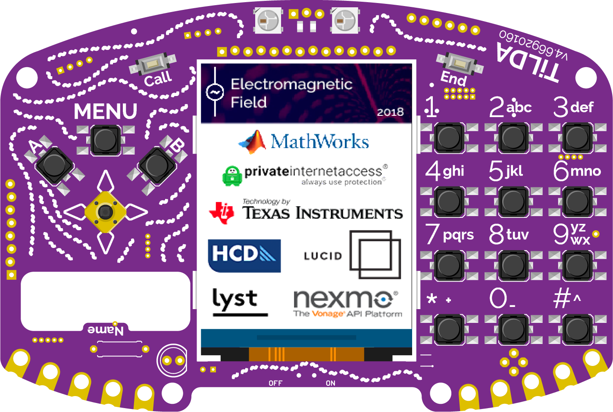
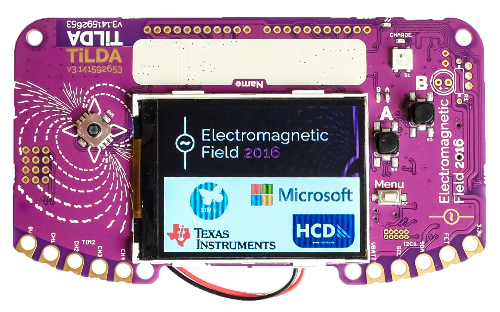

The aim of the EMF badge is to give people interesting hardware they've
probably not experimented with before while being simple enough that
anyone can play with it.

__TOC__

## Contacting the badge team

- email: **badge@emfcamp.org**
- irc: **irc.libera.chat \#emfcamp-badge**
- matrix:
  '''[\#badge:emfcamp.org](https://matrix.to/#/#badge:emfcamp.org)

## EMF2024 - Tildagon

**[Tildagon preliminary
documentation](https://tildagon.badge.emfcamp.org/)**

Announcement blog post: **[Tildagon: The EMF 2024+
badge](https://blog.emfcamp.org/2024/03/18/tildagon/)**

> Introducing the Tildagon: A reusable badge with modular components
> upgraded at each event, and hexpansion slots to fill with your own
> creations.

## EMF2022 - TiDAL

**<a href="TiDAL" class="wikilink"
title="TiDAL documentation main page">TiDAL documentation main page</a>.**

**[App store hatchery](https://2022.badge.emfcamp.org).**

## EMF2018 - TiLDA Mkδ

<figure>

<figcaption>TiLDA_Mk4_Front_with_sponsors.png</figcaption>
</figure>

**<a href="TiLDA_MK4" class="wikilink" title="TiLDA Mkδ main page">TiLDA
Mkδ main page</a>.**

2018 badge announcement on our blog
<http://blog.emfcamp.org/post/177423823788/tilda-mk4-the-emf-2018-badge>

## EMF2016 - TiLDA Mkπ

<figure>

<figcaption>TiLDA_MK3_front.jpg</figcaption>
</figure>

<a href="TiLDA_MK3" class="wikilink" title="TiLDA_MK3">TiLDA_MK3</a>
main page.

2016 badge announcement on our blog
<http://blog.emfcamp.org/post/144514906298/tilda-mkπ-the-hackable-conference-badge-that>

Update, we have sponsors, the badge is saved!

<http://blog.emfcamp.org/post/145667126793/the-emf-tilda-badge-is-saved>

## EMF2014 - TiLDA MKe

<figure>

<figcaption>Tumblr_inline_n9znh3W5tC1rpuop0.jpg</figcaption>
</figure>

The
<a href="TiLDA_MKe" class="wikilink" title="TiLDA MKe project">TiLDA MKe
project</a> is code named "ElectroMagnetic Boogaloo"

The MKe is an entirely new design, based on the Arduino Due. It brings
an LCD display, Accelerometer and Gyro, along with a long-range wireless
transceiver. The original specification was to give people live schedule
updates and camp notifications, but the hardware was capable of much
more.

Please Note: There are a couple of minor hardware and some firmware
issues with the MKe that might be effecting your badge. If you've let
the magic smoke out of your charge controller or have tried to re-flash
and ended up with nothing but a couple of dimly glowing lights then DO
NOT DESPAIR -It's recoverable and fixes, documentation and lots of
firmware are still being produced :)

## EMW2013 - SiNE

<a href="SiNE" class="wikilink"
title="SiNE: Investigating the Neighbourhood of EMW">SiNE: Investigating
the Neighbourhood of EMW</a>

Each attendee of Electromagnetic Wave received a SiNE badge, allowing
them to take part in a treasure hunt based around the boat. By solving
the clues, attendees were directed to an object or location either on or
near the Stubnitz. The clue letter was also the first letter of the
answer - large matching letters fitted with IR code transmitters were
stored at each location. Holding your badge in front of the letter lit
the corresponding light on a badge, allowing the user to collect them
all!

## EMF2012 - TiLDA MK1

[TiLDA](http://wiki-archive.emfcamp.org/2012/articles/b/a/d/Badge.html)
The first EMF camp badge, base around the Arduino Leonard, with on board
IR, NRF24 Radio and RGB LED's.
[Revealing TiLDA, our camp
badge!](http://blog.emfcamp.org/post/28558155390/revealing-tilda-our-camp-badge)

## <a href="Team:Badge" class="wikilink" title="Badge Team">Badge Team</a>

The badge team is being headed by

- <a href="User:Dpslwk" class="wikilink"
  title="&#39;RepRap&#39; Matt">'RepRap' Matt</a> from Nottinghack
- <a href="User:thinkl33t" class="wikilink" title="Bob">Bob</a> from
  Hackspace Manchester